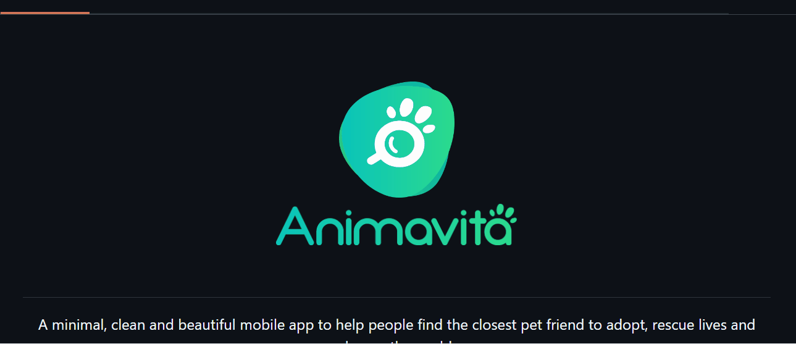

# Projeto com README
Um projeto de teste com um arquivo README🎇

## Tecnologias utilizadas
- HTML
- CSS
- JavaScript
- Git
- GitHub Pages
## Como executar o projeto
1. Clone o repositório
2. Abra o arquivo index.html no navegador
## Como contribuir
1. Clone o repositório
2. Crie uma branch com o seu nome
3. Faça as alterações necessárias
4. Faça o commit das alterações
5. Faça o push da branch para o repositório
## Contato
[seu e-mail](mailto:seuemail@email.com)
[seu linkedin](https://www.linkedin.com/in/seu-linkedin/)

